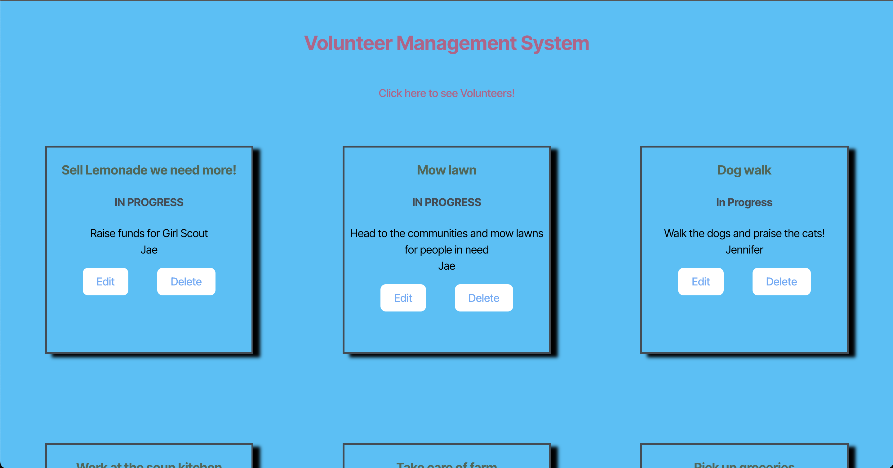
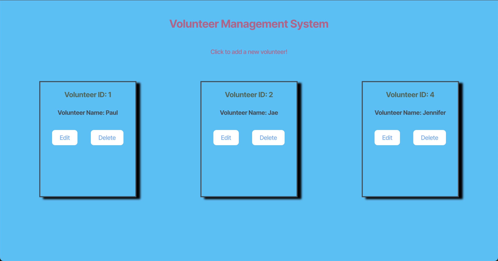
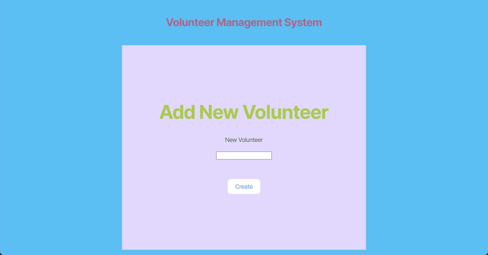
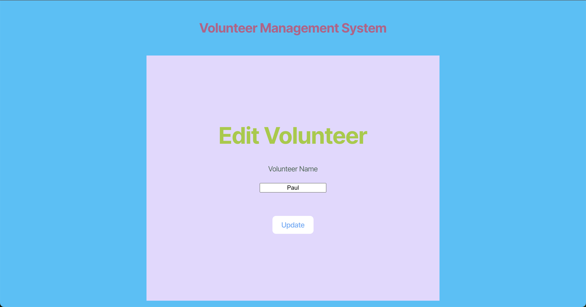
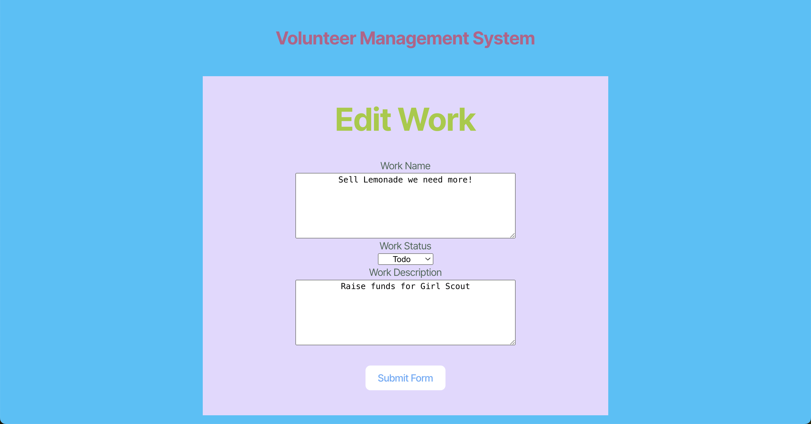

# Module 13 Mini-Project: Volunteer Management System

In this Mini-Project, you'll work with a group to complete a volunteer management system that provides full CRUD application by integrating Sequelize ORM and connecting an Express application with a React application.

## Instructions

The completed app should meet the following criteria:

* As a volunteer organizer for a volunteer management system, I want to store information about volunteers and volunteer work in a relational database by using an ORM for data management. 

* As a volunteer organizer for a volunteer management system, I want to format the `Volunteers` and `Work` models.

* As a volunteer organizer for a volunteer management system, I want to create a one-to-many association between `Volunteers` and `Work` tables.

* As a volunteer organizer for a volunteer management system, I want to update the routes directory so that CRUD data is managed and passed to the routers directory to forward data.

* As a volunteer organizer for a volunteer management system, I want to ensure that the data from the server side creates, reads, updates, and deletes to the client side.

## Mock-Up

The following images show the web application's appearance and functionality:

## Getting Started

You'll primarily be working in the `Develop/server` directory, as well as updating the `Develop/client/vite.config.js` file to connect the server-side and client-side directories.

The `Developer/server/src/models` and `Developer/server/src/routes` content must be updated.

Look for the `TODO`s to help you determine which sections of the application must be updated.

You'll also need to provide your database information in a `.env` file. An example `.env` file, named `.env.EXAMPLE`, is provided in the `server` directory.

To run the application, run `npm i` and `npm run seed` in the root directory of the `Develop` folder after resolving the Sequelize errors. 

To run both the server side and the client side simultaneously, run `npm run start:dev`.

If you want to run all of the installation, seeding, and building at once, run `npm run dev`.

## 📝 Notes

The properties for the Volunteer model and Work model are as follows:

* Volunteer

  * id: Integer

  * name: String

* Work/Volunteer Job

  * id: Integer

  * name: String

  * status: String

  * description: String

  * assignedVolunteerId: Integer (associated with Volunteer as ONE-TO-MANY)

* Note that for one Volunteer, there can be many Works/Volunteer Jobs.

Refer to the documentation:

* [Sequelize Documentation](https://sequelize.org/)

* [Sequelize Documentation on TypeScript](https://sequelize.org/docs/v6/other-topics/typescript/)

* [Vite Documentation on Configuring Vite](https://vitejs.dev/config/)

## 💡 Hints

* How can the documentation give us an idea of the data we'll get back?

* How can we use proxies to connect the server-side and client-side content for local testing?

* How can we use Sequelize's methods to streamline CRUD functionalities?

---
© 2024 edX Boot Camps LLC. Confidential and Proprietary. All Rights Reserved.
